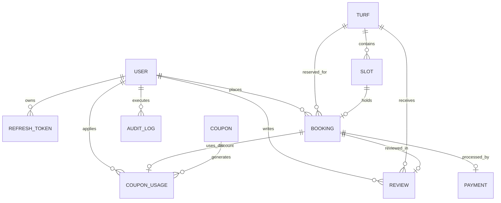
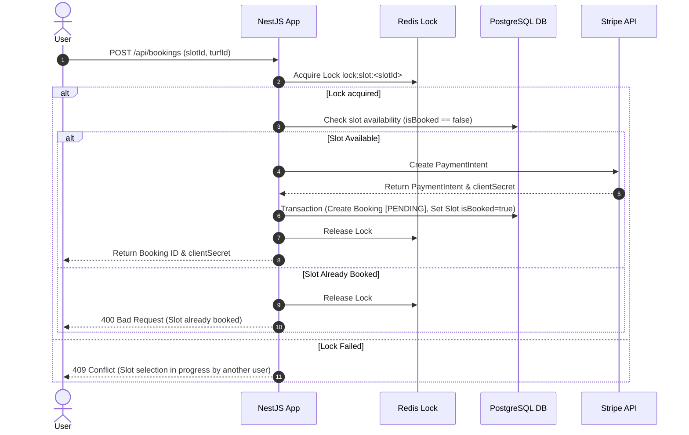

# 🏗️ TurfSync (TurfBook) Architecture Documentation

Welcome to the **TurfSync** system architecture documentation. This document provides a comprehensive overview of the application architecture, design principles, database schema, data flows, infrastructure setup, and security mechanisms.

---

## 📌 Executive Summary

**TurfSync** is an enterprise-grade, high-performance web platform designed for sports turf reservations, slot management, automated scheduling, payment processing, and coupon management. 

The backend is built as a **Modular Monolith** using **NestJS**, leveraging TypeScript for strict typing and modularity. It utilizes **PostgreSQL** for persistent transactional storage, **Redis** for distributed locking, caching, and background queue management (**Bull Queue**), and integrates third-party services such as **Stripe** (payments), **Twilio** (SMS), **Cloudinary** (media storage), and **Sentry/Prometheus/Grafana** (observability).

---

## 🏛️ System Architecture Overview

```mermaid
flowchart TD
    subgraph Client Layer
        Client[Web / Mobile Clients]
    end

    subgraph Edge Layer
        Nginx[Nginx Reverse Proxy / Load Balancer]
    end

    subgraph Application Layer - NestJS Modular Monolith
        API[NestJS Core API Engine]
        
        subgraph Request Pipeline
            MW[Middleware: RequestID]
            Guard[Guards: Throttler, JwtAuth, Roles]
            Pipe[Pipes: ValidationPipe]
            Inter[Interceptors: Logging, Metrics, Response]
            Filter[Filters: Global & Prisma Exception]
        end

        subgraph Core Modules
            AuthMod[Auth Module]
            TurfMod[Turf Module]
            SlotMod[Slot Module]
            BookingMod[Booking & Lock Module]
            PaymentMod[Payment Module]
            AdminMod[Admin Module]
            CouponMod[Coupon Module]
        end

        subgraph Async Task & Queue Engine
            Bull[Bull Queue Engine]
            MailWorker[Mail Processor]
            SmsWorker[SMS Processor]
            SlotCron[Cron Scheduler]
        end
    end

    subgraph Storage & Infrastructure Layer
        PG[(PostgreSQL Database)]
        Redis[(Redis Cache & Queue Store)]
    end

    subgraph External Services
        Stripe[Stripe Payment Gateway]
        Twilio[Twilio SMS Gateway]
        Cloudinary[Cloudinary Media Storage]
    end

    subgraph Observability Stack
        Sentry[Sentry Error Tracking]
        Prometheus[Prometheus Metrics]
        Grafana[Grafana Dashboards]
    end

    %% Flow connections
    Client -->|HTTP / HTTPS| Nginx
    Nginx -->|Proxy Pass :4000| API
    API --> Request Pipeline
    Request Pipeline --> Core Modules
    
    BookingMod -->|Distributed Lock / Cache| Redis
    Core Modules -->|OR Mapping / Prisma| PG
    Core Modules -->|Dispatch Async Jobs| Bull
    Bull --> Redis

    Bull --> MailWorker
    Bull --> SmsWorker
    PaymentMod -->|Stripe API & Webhooks| Stripe
    SmsWorker -->|Send SMS| Twilio
    Core Modules -->|Media Uploads| Cloudinary

    API -->|Logs & Alerts| Sentry
    API -->|Prometheus Metrics| Prometheus
    Prometheus --> Grafana
```

---

## 🧰 Technology Stack

| Layer | Technology / Package | Purpose |
| :--- | :--- | :--- |
| **Framework** | NestJS 11, Node.js, TypeScript | Core application runtime & structure |
| **Database** | PostgreSQL 15 | Relational ACID database |
| **ORM** | Prisma 7 (`@prisma/client`, `@prisma/adapter-pg`) | Type-safe database queries & migrations |
| **Cache & Lock** | Redis 7 (`ioredis`, `@liaoliaots/nestjs-redis`) | Cache storage, rate limiting, and redlock |
| **Queue Engine** | Bull Queue (`@nestjs/bull`) | Asynchronous job processing (emails, SMS) |
| **Authentication** | Passport.js, JWT, Argon2 | Password hashing, token management, cookies |
| **Security** | Helmet, Cookie-Parser, Throttler | HTTP security headers, CORS, rate limiting |
| **Payment** | Stripe API (`stripe`) | Payments, refunds, webhooks idempotency |
| **Third-Party Services** | Twilio, Cloudinary, Nodemailer | SMS alerts, image storage, HTML email templates |
| **Monitoring** | Prometheus, Grafana, Sentry, Winston | Health check, metrics dashboard, error tracking, structured logging |
| **Containerization** | Docker, Docker Compose, Nginx | Multi-container runtime environment & reverse proxy |

---

## 📂 Directory Structure & Module Breakdown

The application follows NestJS modular architecture conventions under `src/`:

```
src/
├── admin/          # Admin management (Audit logs, turf management, analytics)
├── auth/           # Authentication, JWT strategies, Argon2 hashing, lockout logic
├── booking/        # Turf slot booking, price calculation, transaction management
├── common/         # Cross-cutting concerns
│   ├── filters/    # Global HTTP & Prisma exception filters
│   ├── guards/     # Throttler, JWT, and Role-based access control guards
│   ├── interceptors/# Response formatting, request logging, and Prometheus metrics
│   ├── logger/     # Winston daily-rotate file logger configuration
│   ├── middleware/ # Request-ID generation middleware
│   ├── metrics/    # Prometheus metrics exporter configuration
│   └── sentry/     # Sentry exception tracking setup
├── coupon/         # Discount system, coupon validation, usage limit tracking
├── health/         # Terminus health checks for PG, Redis, Disk, and Memory
├── mail/           # Mailer service with Handlebars templates
├── payment/        # Stripe payment intents, webhooks, and refund flows
├── prisma/         # Prisma client service & connection pooling configuration
├── queue/          # Bull queue initialization and job processors (email/SMS)
├── redis/          # Redis connection service & distributed locking utility
├── review/         # User reviews & rating engine for turfs
├── slot/           # Slot generation, availability search, and cron cleanup jobs
├── sms/            # Twilio SMS sending service
├── turf/           # Turf CRUD operations, location search, and filter queries
├── upload/         # Cloudinary SDK integration for file uploads
├── app.module.ts   # Main module wiring all feature modules
└── main.ts         # Bootstrap file (Pipes, Filters, Swagger, Security Middlewares)
```

---

## 📊 Database ERD & Schema Overview

The database uses PostgreSQL managed via **Prisma ORM**. Key models and relationships:



### Main Entities
1. **User**: Role-based access (`USER`, `ADMIN`), login lockout after failed attempts, email verification, Argon2 password hashing.
2. **RefreshToken**: Managed refresh tokens linked to users with expiration indexing.
3. **Turf**: Represents a sports facility with sports types (`FOOTBALL`, `CRICKET`, `BOTH`), hourly pricing, open/close hours, location, and images.
4. **Slot**: Specific time interval for a turf on a given date. Has unique constraint `[turfId, date, startTime]` to prevent duplicate slots.
5. **Booking**: Connects user, turf, and slot. Status states: `PENDING`, `CONFIRMED`, `CANCELLED`, `COMPLETED`.
6. **Payment**: Manages Stripe `PaymentIntent`, transaction amounts, currency, `PaymentStatus`, charge details, and payment time.
7. **WebhookEvent**: Stores Stripe webhook event IDs for **Idempotent processing**.
8. **Coupon / CouponUsage**: Manages discount codes (`PERCENTAGE`, `FIXED`), usage limits, and user tracking.
9. **AuditLog**: Admin action logs for tracking managerial modifications.

---

## 🔄 Core Technical Workflows

### 1. Authentication & Security Pipeline
- **Password Protection**: Argon2 algorithm is used for hashing passwords.
- **Brute-Force Protection**: Tracks failed attempts; locks accounts after exceeding thresholds (`lockoutUntil`).
- **Token Management**: Dual-token pattern. Short-lived Access Tokens (JWT) + Long-lived Refresh Tokens stored securely.
- **Request Guards**:
  - `ThrottlerGuard`: Dual-tier rate limiting (Short: 10 req/sec; Long: 100 req/min).
  - `JwtAuthGuard`: Validates Bearer token or HttpOnly cookie.
  - `RolesGuard`: Enforces RBAC (`USER` vs `ADMIN`).

### 2. Slot Booking & Concurrency Control (Distributed Lock)
To prevent double-booking when multiple users try to reserve the same slot simultaneously:
1. User submits a request to book a slot.
2. Application acquires a **Redis Distributed Lock** key `lock:slot:<slotId>`.
3. Checks if `Slot.isBooked === false`.
4. Executes a PostgreSQL database transaction to:
   - Create `Booking` record with `PENDING` status.
   - Set `Slot.isBooked = true`.
   - Issue Stripe `PaymentIntent`.
5. Releases the Redis lock.
6. Returns `clientSecret` for Stripe checkout.



### 3. Stripe Webhook & Idempotency Flow
1. Stripe triggers `POST /api/payments/webhook` with signature headers.
2. **Raw Body Parsing**: Raw payload is captured for cryptographic signature verification using `bodyParser.raw`.
3. **Idempotency Check**: Checks `WebhookEvent` table for event `id`. If event exists, ignores to prevent duplicate processing.
4. On `payment_intent.succeeded`:
   - Updates `Payment` status to `PAID`.
   - Updates `Booking` status to `CONFIRMED`.
   - Records event ID into `WebhookEvent` table.
   - Pushes an asynchronous notification job to **Bull Queue** (Email & SMS confirmation).

### 4. Background Job Queue (Bull & Redis)
Asynchronous operations are decoupled from the HTTP request-response cycle to ensure sub-100ms response times:
- **Email Queue**: Sends welcome emails, verification tokens, booking confirmations, and cancellation notices.
- **SMS Queue**: Dispatches Twilio SMS notifications for instant booking updates.
- **Slot Cron Job**: Automatically generates future slots for active turfs and cleans up unconfirmed expired bookings.

---

## ⚡ Request Lifecycle & Interceptors

Every incoming request traverses a structured NestJS execution pipeline:

```
[ Incoming Request ]
        │
        ▼
[ RequestIdMiddleware ] ── Adds X-Request-ID to request headers
        │
        ▼
[ ThrottlerGuard ] ────── Enforces Rate Limits
        │
        ▼
[ JwtAuthGuard ] ──────── Validates JWT Credentials
        │
        ▼
[ RolesGuard ] ────────── Validates User Roles (ADMIN / USER)
        │
        ▼
[ ValidationPipe ] ────── Validates DTOs & strips non-whitelisted fields
        │
        ▼
[ LoggingInterceptor ] ── Logs request duration & method via Winston
        │
        ▼
[ MetricsInterceptor ] ── Collects request stats for Prometheus
        │
        ▼
[ Controller & Service ] ── Core Business Logic Execution
        │
        ▼
[ ResponseInterceptor ] ─ Standardizes JSON API output structure
        │
        ▼
[ Exception Filters ] ── GlobalExceptionFilter / PrismaExceptionFilter (If error occurs)
        │
        ▼
[ Response Sent ]
```

---

## 🛡️ Monitoring, Observability & Health Checks

- **Logging**: **Winston** daily log rotation (`logs/application-%DATE%.log`) capturing standard, error, and debug logs.
- **Error Tracking**: Integration with **Sentry** captures uncaught exceptions with full stack traces and environment metadata.
- **Prometheus & Grafana**: Exposes `/metrics` endpoint for real-time memory usage, HTTP response times, active connections, and database query durations visualized in **Grafana dashboards**.
- **Health Checks**: `/api/health` powered by `@nestjs/terminus` monitors PostgreSQL readiness, Redis ping response, memory bounds, and disk storage.

---

## 🐳 Deployment & Containerization Architecture

TurfSync provides multi-environment setup with **Docker Compose**:

### Services Architecture:
- **turfbook_nginx**: Reverse proxy handling SSL termination and proxying traffic to application container on port `4000`.
- **turfbook_app**: NestJS multi-stage Docker container running in Node environment.
- **turfbook_postgres**: PostgreSQL 15 database instance with persistent volume mount (`postgres_data`).
- **turfbook_redis**: Redis 7 container configured with AOF (`appendonly yes`) persistence for queues and locks.
- **turfbook_prometheus & turfbook_grafana**: Metrics collection and real-time dashboard analytics.

---

## 🔐 Security Best Practices Implemented

1. **Helmet HTTP Headers**: Enforces CSP, HSTS, X-Frame-Options, and X-Content-Type-Options.
2. **CORS Validation**: Restricts cross-origin requests to trusted origins specified in environment variables.
3. **Data Transfer Object (DTO) Sanitization**: Strict input validation using `class-validator` with whitelist enforcement.
4. **Prisma Connection Pooling**: Programmatic connection management via `@prisma/adapter-pg` preventing pool exhaustion.
5. **No Database URL Leaks**: Database credentials managed securely in environment variables.

---

## 🛠️ Developer Commands Quick Reference

| Command | Description |
| :--- | :--- |
| `npm run start:dev` | Starts application with hot-reload, generates Prisma client, and syncs DB schema |
| `npm run build` | Compiles NestJS TypeScript source to production bundle in `dist/` |
| `docker-compose -f docker-compose.dev.yml up -d` | Launches complete development environment stack (App, Postgres, Redis, Nginx, Grafana) |
| `npm run test` | Runs unit test suite |
| `npm run test:e2e` | Runs end-to-end integration tests |
| `npx prisma studio` | Opens visual GUI for managing database records |
