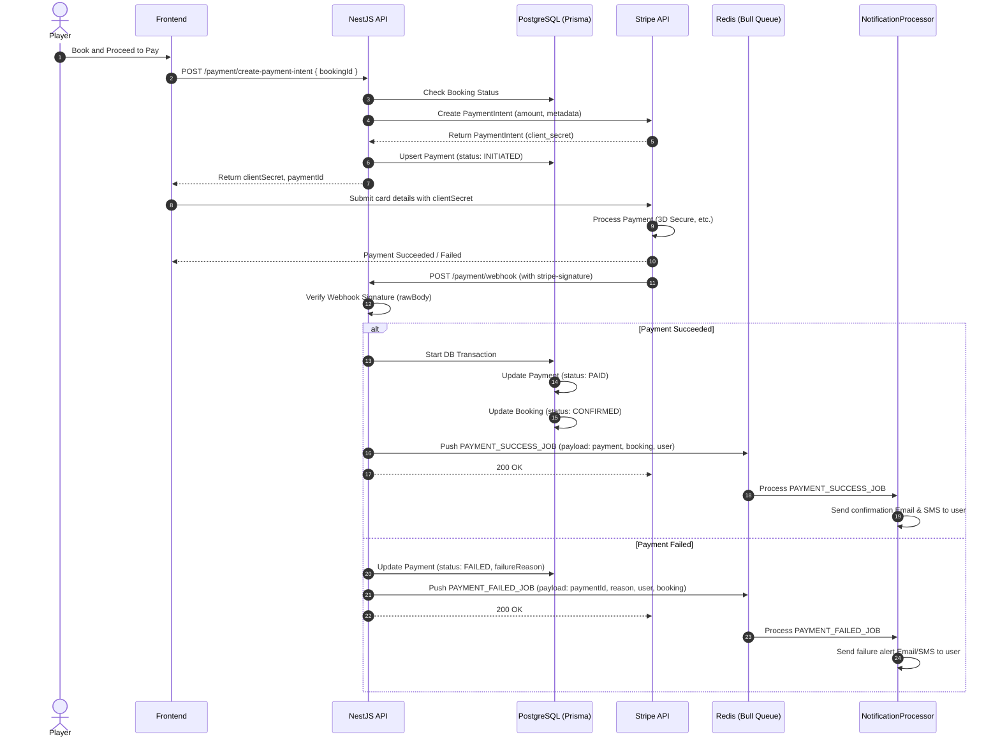
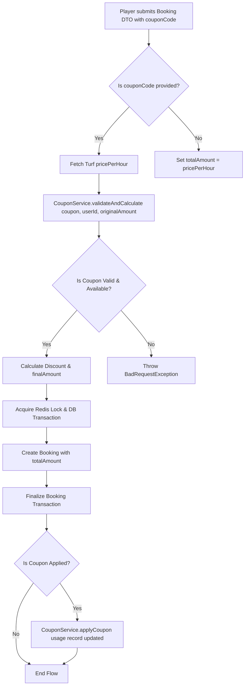

# 🏟️ TurfSync: Advanced Turf Booking & Management System

<div align="center">
  
  
  <h3>Enterprise-Grade Sports Turf Booking & Management Platform</h3>

  [](https://nestjs.com/)
  [](https://www.typescriptlang.org/)
  [](https://www.postgresql.org/)
  [](https://www.prisma.io/)
  [](https://redis.io/)
  [](https://www.docker.com/)
  [](https://stripe.com/)
  [](https://www.twilio.com/)
</div>

---

## 📋 Table of Contents
- [🎯 Overview](#-overview)
- [🛠️ Tech Stack](#-tech-stack)
- [✨ Core Features](#-core-features)
- [📁 Interactive Project Structure](#-interactive-project-structure)
- [💳 Payment & Queue Architecture](#-payment--queue-architecture)
- [🎟️ Coupon Integration Workflow](#-coupon-integration-workflow)
- [🔒 Security & Hardening Policies](#-security--hardening-policies)
- [🛡️ Administrative Control & Optimization](#-administrative-control--optimization)
- [ concurrency-control--idempotency](#-concurrency-control--idempotency)
- [🚀 Quick Start Guide](#-quick-start-guide)
- [📊 Monitoring & Observability](#-monitoring--observability)
- [🧪 Testing & Quality Assurance](#-testing--quality-assurance)
- [🔌 Interactive API Reference](#-interactive-api-reference)

---

## 🎯 Overview

**TurfSync** is a high-performance backend REST API designed for managing sports turf bookings (Football, Cricket, etc.). Built with **NestJS v11** and **TypeScript**, the system supports multiple user roles (Players, Turf Owners, Admins) with distinct workflows, real-time slot availability management, and transaction-safe booking operations.

### Key Objectives
* ⚡ **Zero Double Bookings**: Guaranteed via Redis distributed locks and Postgres row-level locking.
* 💳 **Secure Payment Processing**: Integrated seamlessly with Stripe Checkout and Webhooks.
* 🎟️ **Flexible Promotion Systems**: Intelligent and validation-safe discount coupon codes.
* 📨 **Reliable Notifications**: Decoupled asynchronous Email & SMS notification queues.

---

## 🛠️ Tech Stack

| Category | Technology |
|----------|-----------|
| **Runtime & Framework** | Node.js (v22), NestJS 11, TypeScript |
| **Databases** | PostgreSQL (Relational DB), Redis (Locking, Caching, and Queue Backend) |
| **ORM & Tools** | Prisma ORM |
| **Queueing Engine** | Bull Queue (Redis-backed async job processors) |
| **External APIs** | Stripe (Payments), Twilio (SMS Notifications), Cloudinary (Image Hosting) |
| **Testing Framework** | Jest, Supertest |
| **Quality Control** | ESLint, Prettier |
| **Ops & Deployments** | Docker, Docker Compose, Kubernetes (K8s) |

---

## ✨ Core Features

### ⚽ Turf & Slot Management
* **Role-Based Access Control (RBAC)**: Custom permissions for Players, Turf Owners, and Admins.
* **Slot Auto-Generation & Completion**: Automatically generates time slots and completes bookings via cron jobs.
* **Bulk Image Uploads**: Directly integrated with Cloudinary for fast, optimized image rendering.

### 💳 Stripe & Webhook Integrations
* **Stripe Payment Intent**: Seamlessly initiates checkout with strict metadata validation.
* **Robust Webhooks**: Secure signatures check (`req.rawBody`) with an **idempotent log registry** to prevent duplicate processing.

### 🎟️ Coupon & Discount engine
* **Active Coupon Validations**: Validates expiration dates, maximum usage limits, and per-user usage limits.
* **Atomic Usage Counter**: Updates coupon usage history atomically after the booking transaction successfully completes.

### 🔒 Hardened Security
* **Brute-Force Protection**: 5 failed login attempts triggers a **15-minute temporary lockout**.
* **Refresh Token Rotation (RTR)**: Single-use refresh tokens hashed with SHA-256 to stop replay attacks.
* **Argon2id Hashing**: Industry-standard cryptographic password hashing (OWASP recommendation).
* **Fail-Closed Guards**: Default-deny access strategy if required route parameters or metadata are missing.

---

## 📁 Interactive Project Structure

<details>
<summary>📂 <b>Click to expand/collapse full file directory</b></summary>

```bash
turfbook/
├── prisma/
│   ├── schema.prisma           # Prisma Database schema definitions
│   └── migrations/             # SQL migration files
├── src/
│   ├── admin/                  # Administrative services, metrics, and overrides
│   ├── auth/                   # Authentication, guards, and strategy implementations
│   ├── booking/                # Booking service logic, DTOs, and unit tests
│   ├── common/                 # Interceptors, filters, custom decorators, and pagination helpers
│   ├── coupon/                 # Coupon code validation, creation, and logs
│   ├── mail/                   # Automated mailer services with Handlebars template engine
│   ├── payment/                # Stripe API service, webhook handler, and models
│   ├── queue/                  # Bull queue processors for async dispatches
│   ├── redis/                  # Redis connection and distributed lock services
│   ├── sms/                    # Twilio SMS initialization and dispatch services
│   ├── main.ts                 # Main bootstrap entrypoint
│   └── app.module.ts           # Root configuration module
├── test/                       # Global E2E test suites
├── docker-compose.dev.yml      # Development container orchestration configuration
├── tsconfig.json               # TypeScript compilation settings
└── README.md                   # Project documentation
```
</details>

---

## 💳 Payment & Queue Architecture

The diagram below shows the event-driven Stripe checkout sequence and notification queuing:



---

## 🎟️ Coupon Integration Workflow

The coupon validation and application sequence is executed transaction-safely to prevent race conditions:



---

## 🔒 Security & Hardening Policies

### 1. Account Lockout
* Tracks consecutive invalid login attempts (`failedLoginAttempts`).
* Triggers a **15-minute temporary lockout** after **5 failed attempts**.
* Rejects any subsequent attempts during the cooldown period with a clear lockout expiration countdown.

### 2. Hashed Refresh Token Rotation
* Replaces the current Refresh Token with a newly issued pair on every refresh request.
* All refresh tokens are permanently hashed using SHA-256 before being stored in the database, protecting active sessions from database leaks.

### 3. Fail-Closed Route Guards
* Route authentication guards operate on a strict **fail-closed** policy: if a protected endpoint lacks the required role declarations, it immediately denies access (HTTP 403) instead of bypassing verification.

---

## 🛡️ Administrative Control & Optimization

### 📈 High-Performance Revenue Analytics
* Avoids database round-trips by processing date-grouped statistics (`date_trunc`) directly on PostgreSQL via raw query aggregations (`$queryRaw`).
* Implements $O(1)$ in-memory mapping using JavaScript `Map` objects, dropping algorithmic complexity from $O(N \times M)$ to $O(N + M)$ and reducing DB query load by up to 95%.

### ⏰ Timezone-Safe Autocomplete & Cron Jobs
* Cron jobs run every 5 minutes in a unified PostgreSQL transaction (`BookingService.cleanupStalePendingBookings`) to garbage collect stale, unpaid pending bookings.
* Normalizes server offsets by using explicit UTC date calculations (`setUTCHours`) for time-based comparisons.

---

## 🔒 Concurrency Control & Idempotency

* **Row-Level Locking**: Employs `SELECT ... FOR UPDATE` raw database locks on slot creation, ensuring no two concurrent requests can reserve or modify the same slot at the exact same moment.
* **Webhook Idempotency Key**: Utilizes Stripe transaction IDs as primary database keys. Duplicate webhook requests trigger atomic database key collisions, preventing double confirmations.

---

## 🚀 Quick Start Guide

### Prerequisites
* **Node.js** >= 18 (v22 recommended)
* **Docker & Docker Compose**
* **npm** >= 9

### 1. Setup Environment
Clone the repository and copy the sample env:
```bash
git clone https://github.com/awoladhossain/TurfSync.git
cd TurfSync
cp .env.example .env
```

### 2. Fire Up Infrastructure
Spin up the PostgreSQL, Redis, and Monitoring servers in the background:
```bash
docker compose -f docker-compose.dev.yml up -d
```

### 3. Initialize Database
Install dependencies, generate the Prisma client, and run migrations:
```bash
npm install
npx prisma generate
npx prisma migrate dev
```

### 4. Run the App
<details>
<summary>⚡ <b>Click to expand run commands</b></summary>

```bash
# Start development watch mode
npm run start:dev

# Run typecheck compiler validation
npx tsc --noEmit

# Run linters
npm run lint
```
</details>

---

## 📊 Monitoring & Observability

TurfSync has integrated observability out-of-the-box. Access dashboards using these endpoints:

| Service | Access URL | Credentials |
|---------|------------|-------------|
| **Prometheus** | `http://localhost:9090` | *No auth required* |
| **Grafana** | `http://localhost:3001` | **Username:** `admin` <br> **Password:** `admin123` |

### Key Metrics Tracked
* **HTTP Latencies**: Request rates and `p95` response latency histograms.
* **Prisma Performance**: Custom duration queries tracking database latencies.
* **Cache Metrics**: Redis hit-and-miss ratio.
* **Business KPI**: Total bookings created/cancelled, payment success rates, and active player counts.

---

## 🧪 Testing & Quality Assurance

All test suites are configured via Jest. Run validations with the following commands:

```bash
# Run unit & service tests
npm run test

# Run End-to-End (E2E) integration tests
npm run test:e2e

# Run tests with HTML coverage report
npm run test:cov
```

---

## 🔌 Interactive API Reference

* **Interactive OpenAPI/Swagger**: Open `http://localhost:3000/api/docs` while the server is running.
* **Authorization**: Click the **Authorize** lock button in the Swagger header and paste your JWT Bearer token to test protected routes.

---

**Happy Coding! 🚀**
