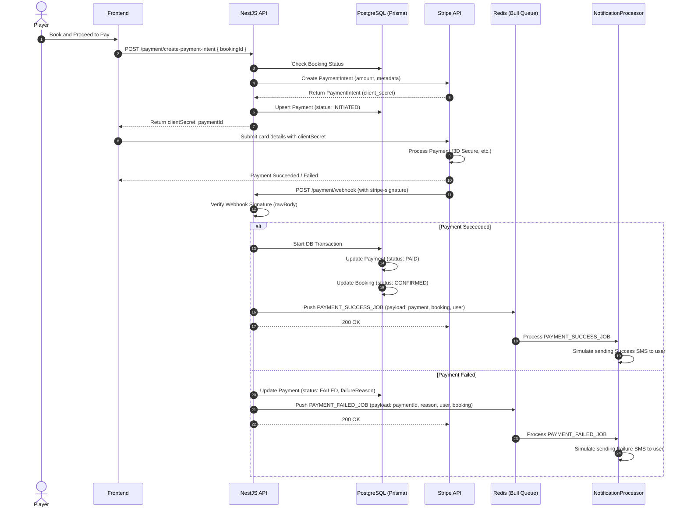

# 🏟️ TurfBook: Advanced Turf Booking & Management System

**TurfBook** is a high-performance backend application for managing sports turf bookings (Football, Cricket, etc.). Built with **NestJS** and **TypeScript**, this project implements enterprise-level architecture patterns with a focus on reliability, scalability, and clean code practices.

---

## 📋 Table of Contents
- [Overview](#overview)
- [Tech Stack](#tech-stack)
- [Features](#features)
- [Project Structure](#project-structure)
- [Payment & Notification System Architecture](#payment--notification-system-architecture)
- [Authentication & Session Security Hardening](#authentication--session-security-hardening)
- [Installation](#installation)
- [Running the Application](#running-the-application)
- [Monitoring & Observability](#monitoring--observability)
- [Testing](#testing)
- [API Documentation](#api-documentation)
- [Development Guidelines](#development-guidelines)
- [Contributing](#contributing)
- [License](#license)

---

## 🎯 Overview

TurfBook is a backend REST API designed to facilitate turf (sports ground) booking management. The system supports multiple user roles (Players, Turf Owners, Admins) with distinct workflows, real-time slot availability management, and transaction-safe booking operations.

### Key Objectives
- Prevent double booking through atomic transactions
- Provide a seamless booking experience for players
- Enable turf owners to manage availability and pricing
- Maintain high availability and performance under load

---

## 🛠️ Tech Stack

| Category | Technology |
|----------|-----------|
| **Runtime** | Node.js |
| **Framework** | NestJS 11 |
| **Language** | TypeScript |
| **Database** | PostgreSQL |
| **ORM** | Prisma |
| **Caching & Locking** | Redis (ioredis) |
| **Queueing** | Bull (Redis-backed) |
| **Storage** | Cloudinary |
| **Email Gateway** | Nodemailer (with Handlebars template engine) |
| **SMS Gateway** | Twilio |
| **Validation** | class-validator, class-transformer |
| **Testing** | Jest |
| **Code Quality** | ESLint, Prettier |
| **Containerization** | Docker, Docker Compose |
| **Configuration** | @nestjs/config |

---

## ✨ Features

### Core Features
- **Role-Based Access Control (RBAC)** - Distinct workflows for Players, Turf Owners, and Admins
- **Atomic Booking Logic** - Prevents double booking using PostgreSQL transactions
- **Real-time Slot Management** - Dynamic availability tracking with instant status updates
- **User Authentication** - Secure session management with configuration-based settings
- **Image Upload Integration** - Multi-file image uploading backed by Cloudinary
- **Notifications Integration** - Automated, templated Email alerts and SMS dispatches (via Twilio)
- **Coupon Management** - Discount coupon generation, validation, and usage
- **Request Validation** - Type-safe DTO validation with class-validator

### Technical Highlights
- **Modular Architecture** - Clean separation of concerns with independent modules (Auth, Admin, Turf, Slot, Booking, Payment, Coupon, Upload, Mail, SMS)
- **Error Handling** - Comprehensive exception handling with custom error responses
- **Testing Coverage** - Unit tests and E2E tests with Jest
- **Development Experience** - Hot reload, debug mode, and watch mode support
- **Code Quality** - Automated linting and formatting with ESLint and Prettier

---

## 📁 Project Structure

```
turfbook/
├── src/
│   ├── app.module.ts           # Root application module
│   ├── app.controller.ts       # Main HTTP controller
│   ├── app.controller.spec.ts  # Unit tests for controller
│   ├── app.service.ts          # Business logic service
│   ├── main.ts                 # Application bootstrap
│   └── [modules]/              # Feature modules (to be expanded)
├── test/
│   ├── app.e2e-spec.ts         # End-to-end tests
│   └── jest-e2e.json           # Jest E2E configuration
├── docker-compose.yml          # Docker Compose configuration
├── package.json                # Dependencies and scripts
├── tsconfig.json               # TypeScript configuration
├── tsconfig.build.json         # TypeScript build configuration
├── eslint.config.mjs           # ESLint configuration
├── nest-cli.json               # NestJS CLI configuration
└── README.md                   # This file
```

---

## 💳 Payment & Notification System Architecture

This project implements a secure, asynchronous, and event-driven payment system using **Stripe**, **Bull (Redis-backed queue)**, and **PostgreSQL (Prisma ORM)**. 

### Architecture Flow



### Components & Responsibilities

#### 1. `PaymentController` (`src/payment/payment.controller.ts`)
* **`createPaymentIntent`**: Secure endpoint (`@UseGuards(JwtAuthGuard)`) that receives a `bookingId` and starts the Stripe Checkout flow by generating a `clientSecret`.
* **`handleWebhook`**: Public endpoint (`POST /webhook`) that acts as the entry point for Stripe asynchronous event notifications. It verifies the Stripe webhook signature using raw request body (`req.rawBody`) before parsing the payload.

#### 2. `PaymentService` (`src/payment/payment.service.ts`)
* **`createPaymentIntent`**: Performs validation checks (booking existence, authorization, payment status). It converts the booking amount into cents (Stripe requirement) and invokes the Stripe API. It registers or updates a payment record in the database with `INITIATED` status.
* **`handleWebhook`**: Coordinates incoming events.
* **`handlePaymentSuccess`**: Runs a PostgreSQL transaction to ensure consistency:
  1. Updates the `payment` status to `PAID`, saving the Stripe Charge ID and payment timestamp.
  2. Updates the `booking` status to `CONFIRMED`.
  3. Dispatches `PAYMENT_SUCCESS_JOB` containing `payment`, `booking`, and `user` data into the Redis-backed Bull queue.
* **`handlePaymentFailed`**: Updates the database `payment` status to `FAILED`, stores the failure reason, and dispatches a `PAYMENT_FAILED_JOB` with the necessary payload to the Bull queue.

#### 3. `Bull Queue` & `NotificationProcessor` (`src/queue/processors/notification.processor.ts`)
* Decouples time-consuming and non-blocking tasks (like sending SMS notifications or emails) from the main request/response lifecycle.
* **`handlePaymentSuccess`**: Pulls the job from Redis, extracts the payment details, and triggers the SMS simulation for booking confirmation.
* **`handlePaymentFailed`**: Extracts the failure reason and payment details, sending a failure alert SMS to the user.

---

## 🔒 Authentication & Session Security Hardening

To prevent unauthorized access, brute-force attacks, and token theft, TurfBook implements a hardened security model for user authentication and session management:

### 1. Brute-Force Protection (Account Lockout Policy)
* **Failed Attempt Tracking**: The system tracks the number of consecutive incorrect password attempts (`failedLoginAttempts`) on the `User` model.
* **Temporary Account Lockout**: After **5 consecutive failed attempts**, the account is locked for **15 minutes** (`lockoutUntil` timestamp is set).
* **Cooldown Message**: Any subsequent login attempt during the lockout period is immediately rejected with a custom error message detailing the remaining minutes.
* **Lockout Reset**: The failed attempts counter and lockout timestamp are fully reset to default state (`0`/`null`) upon:
  * A successful login.
  * A successful password reset through the verified email flow.

### 2. Refresh Token Rotation (RTR)
* **Single-Use Tokens**: Every time a client requests a new Access Token using their Refresh Token, the old Refresh Token is permanently deleted, and a brand-new Refresh Token is issued. This prevents replay attacks if a token is intercepted.
* **Token Hashing (SHA-256)**: Refresh tokens are hashed using SHA-256 before being stored in the database. This ensures that even if the database is compromised, an attacker cannot extract or reuse active session tokens.

### 3. Session Invalidation & Multi-Device Logout
* **Logout Current**: Revokes and deletes the specific refresh token associated with the current session.
* **Logout All Devices**: Allows users to terminate all active sessions across all devices (e.g., in case of a security breach) by wiping out all refresh tokens linked to their `userId`.

### 4. Advanced Cryptographic Protections
* **Argon2id Hashing**: User passwords are saved as hashes created with Argon2id (OWASP recommended parameters: memory cost 19MB, time cost 2, parallelism 1), providing maximum resistance to GPU-based hash-cracking attacks.
* **Secure Cookie Authentication**: Cookies are used with the `HttpOnly`, `Secure` (production), and `SameSite=Lax` flags to prevent XSS-based token extraction.

---

## 🔧 Installation

### Prerequisites
- **Node.js** >= 18 (v22 recommended)
- **npm** >= 9 or **yarn** >= 1.22
- **Docker** and **Docker Compose** (optional, for containerized setup)

### Steps

1. **Clone the repository:**
   ```bash
   git clone https://github.com/yourusername/turfbook.git
   cd turfbook
   ```

2. **Install dependencies:**
   ```bash
   npm install
   ```

3. **Configure environment variables:**
   Create a `.env` file in the root directory (optional, for advanced configuration):
   ```bash
   cp .env.example .env  # if available
   ```

4. **Set up the database (if using PostgreSQL):**
   ```bash
   # Using Docker Compose
   docker-compose up -d

   # Or run your PostgreSQL service locally
   ```

5. **Run database migrations (if using Prisma):**
   ```bash
   npx prisma migrate dev
   ```

---

## 🚀 Running the Application

### Development Mode
Start the application in watch mode with auto-reload:
```bash
npm run start:dev
```
The API will be available at `http://localhost:3000`

### Production Mode
Build and run the optimized production version:
```bash
npm run build
npm run start:prod
```

### Debug Mode
Start the application with Node debugger enabled:
```bash
npm run start:debug
```
Attach your IDE debugger to port 9229

### Using Docker
```bash
# Build and run with Docker Compose
docker-compose up --build

# Run in detached mode
docker-compose up -d

# View logs
docker-compose logs -f

# Stop services
docker-compose down
```


---

## 📊 Monitoring & Observability

TurfBook includes built-in support for real-time monitoring and observability using **Prometheus** and **Grafana**.

### Services & Access URLs

When running the application via Docker Compose, the following monitoring services are automatically started:

| Service | Access URL | Default Credentials |
|---------|------------|---------------------|
| **Prometheus** | `http://localhost:9090` | *No auth required* |
| **Grafana** | `http://localhost:3001` | **Username:** `admin` <br> **Password:** `admin123` |

### Key Metrics Tracked

The NestJS API exposes custom Prometheus metrics at `/api/metrics` (mapped to global prefix). These include:

* **HTTP Request Metrics:**
  * `http_requests_total` - Total HTTP requests tracked by method, route, and status code (visualized as **Request Rate / RPS**).
  * `http_request_duration_seconds` - HTTP request latency histogram (visualized as **p95 Latency**).
* **Database Metrics:**
  * `db_query_duration_seconds` - PostgreSQL query duration histogram tracked using Prisma Client Extensions (visualized as **p95 Database Query Duration**).
* **Cache Metrics:**
  * `redis_cache_hits_total` / `redis_cache_misses_total` - Redis cache hits and misses tracked by cache type (visualized as **Redis Cache Hit Rate**).
* **Business Metrics:**
  * `bookings_total` - Total bookings tracked by status (`created`, `cancelled`, `completed`).
  * `payments_total` - Total payments tracked by status (`success`, `failed`, `refunded`) (visualized as **Payment Success Rate**).
  * `active_users_gauge` - Active users count gauge.

### Provisioned Dashboards

Grafana is pre-configured with a dashboard provider that automatically loads the **TurfBook Dashboard** from `monitoring/grafana/dashboards/turfbook.json`. The dashboard includes panels for RPS, p95 Latency, Error Rate, Bookings Created, Payment Success Rate, Redis Cache Hit Rate, and p95 Database Query Duration.

---

## 🧪 Testing

### Run All Tests
```bash
npm run test
```

### Run Tests in Watch Mode
Monitor and re-run tests on file changes:
```bash
npm run test:watch
```

### Run Tests with Coverage
Generate coverage report:
```bash
npm run test:cov
```

### Run E2E Tests
```bash
npm run test:e2e
```

### Debug Tests
Launch Jest with Node debugger:
```bash
npm run test:debug
```

---

## 📚 Code Quality

### Format Code
Auto-format with Prettier:
```bash
npm run format
```

### Lint Code
Run ESLint with auto-fix:
```bash
npm run lint
```

---

## 🔌 API Documentation

The project includes interactive API documentation powered by Swagger (OpenAPI).

### Swagger UI
When the application is running, the interactive documentation is available at:
* **URL:** `http://localhost:3000/api/docs`
* **Features:**
  * Interactive endpoint exploration and testing
  * Real-time query and request execution
  * Persistent JWT Bearer Authorization (click the **Authorize** button at the top or on individual endpoints and enter your JWT to access protected routes)

### Base URL
```
http://localhost:3000/api
```

### Health Check
```http
GET /api/health
```

### Available Endpoints (Grouped in Swagger)
- **Auth** - User registration, login, logout, and token refresh
- **Admin** - Admin dashboard metrics, user lists, and slot manual override
- **Turfs** - Turf listing, details, creation, updating, and removal
- **Slots** - Time slot listings, bulk generation, and cleanups
- **Bookings** - Slot booking, listing, details, and cancellation
- **Payments** - Stripe payment intent creation, status checks, and refunds
- **Coupons** - Discount coupon creation, lists, validation, and usage
- **Uploads** - Cloudinary-backed file and image uploading services
- **Mail** - Automated template-based email notifications
- **SMS** - Notification SMS dispatching services

---

## 🏗️ Development Guidelines

### Code Structure
- **Modules** - Feature-based modules in `src/`
- **Controllers** - HTTP request handlers
- **Services** - Business logic and data operations
- **DTOs** - Data Transfer Objects for request/response validation
- **Entities** - Database models
- **Guards** - Authorization and authentication logic
- **Middleware** - Request/response interceptors

### Best Practices
1. **Type Safety** - Always use TypeScript; avoid `any` type
2. **Validation** - Use class-validator DTOs for request validation
3. **Error Handling** - Use NestJS exception filters
4. **Testing** - Write tests alongside features; aim for >80% coverage
5. **Code Style** - Follow ESLint rules; run formatter before commit
6. **Documentation** - Add JSDoc comments for complex logic
7. **Transactions** - Use database transactions for critical operations

### Global Validation Pipe
All incoming HTTP requests are validated globally via a NestJS `ValidationPipe` configured in `src/main.ts` with:
- **`whitelist: true`**: Automatically strips any properties from the request body that do not have a validation decorator in the associated DTO.
- **`forbidNonWhitelisted: true`**: Throws an HTTP 400 Bad Request if any properties not present in the whitelist are provided.
- **`transform: true`**: Automatically transforms incoming plain payloads into typed instances of their corresponding DTO classes (e.g., converting numeric strings to numbers).

### Creating a New Module
```bash
nest generate module features/users
nest generate controller features/users
nest generate service features/users
```

---

## 📦 Dependencies

### Core Dependencies
- `@nestjs/common` - NestJS core module
- `@nestjs/core` - NestJS runtime
- `@nestjs/platform-express` - Express.js integration
- `@nestjs/config` - Configuration management
- `class-validator` - DTO validation
- `class-transformer` - DTO transformation
- `reflect-metadata` - Metadata reflection
- `rxjs` - Reactive programming library

### Dev Dependencies
- `jest` - Testing framework
- `elasticsearch` - ESLint configuration
- `prettier` - Code formatter
- `@nestjs/testing` - NestJS testing utilities
- `@nestjs/cli` - Command line tools
- `ts-jest` - TypeScript support for Jest
- `supertest` - HTTP assertion library
- `typescript` - TypeScript compiler

---

## 🐛 Troubleshooting

### Port Already in Use
If port 3000 is occupied:
```bash
# Change the default port
PORT=3001 npm run start:dev

# Or kill the process
lsof -i :3000
kill -9 <PID>
```

### Database Connection Error
- Verify PostgreSQL is running
- Check `.env` database credentials
- Ensure database exists
- Run migrations: `npx prisma migrate dev`

### Dependencies Issues
```bash
# Clear node_modules and reinstall
rm -rf node_modules package-lock.json
npm install
```

### TypeScript Errors
```bash
# Recompile TypeScript
npm run build

# Or check for type errors
npx tsc --noEmit
```

---

## 📋 Checklist for New Developers

- [ ] Node.js and npm installed
- [ ] Repository cloned
- [ ] Dependencies installed (`npm install`)
- [ ] Environment variables configured (`.env`)
- [ ] Database set up and migrations run
- [ ] Application starts successfully (`npm run start:dev`)
- [ ] Tests pass (`npm run test`)
- [ ] ESLint passes (`npm run lint`)

---

## 🤝 Contributing

Contributions are welcome! Please follow these guidelines:

1. **Fork the repository**
2. **Create a feature branch** (`git checkout -b feature/amazing-feature`)
3. **Commit changes** (`git commit -m 'Add amazing feature'`)
4. **Push to branch** (`git push origin feature/amazing-feature`)
5. **Open a Pull Request**

### Code Review Criteria
- All tests pass
- Code follows ESLint rules
- No console.log statements in production code
- TypeScript has strict mode enabled
- Test coverage maintained or improved
- Commit messages are clear and descriptive

---

## 📄 License

This project is licensed under the **UNLICENSED** license. See [LICENSE](./LICENSE) file for details.

---

## 📞 Support

For issues, questions, or suggestions:
- Open an issue on GitHub
- Check existing documentation
- Review test files for usage examples

---

## 🔗 Useful Resources

- [NestJS Documentation](https://docs.nestjs.com)
- [TypeScript Handbook](https://www.typescriptlang.org/docs)
- [Jest Documentation](https://jestjs.io)
- [Prisma Documentation](https://www.prisma.io/docs)
- [PostgreSQL Documentation](https://www.postgresql.org/docs)

---

**Happy Coding! 🚀**

Last Updated: April 2026
