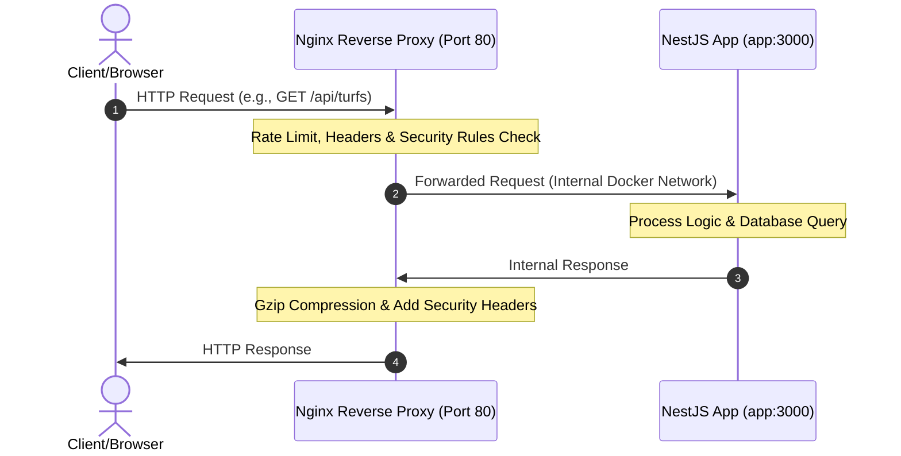
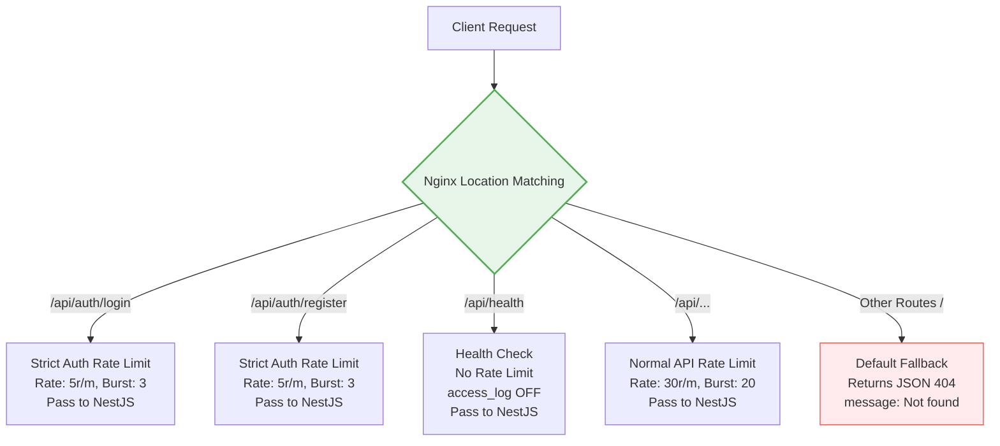

# 🚀 Nginx Architecture & Configuration Guide

এই ডকুমেন্টে **TurfSync** প্রজেক্টের **Nginx Reverse Proxy** কনফিগারেশনের প্রতিটি লাইন সহজ ভাষায়, বাস্তব উদাহরণ, ডায়াগ্রাম এবং গভীর টেকনিক্যাল ব্যাখ্যাসহ আলোচনা করা হয়েছে।

---

## 📌 সূচিপত্র (Table of Contents)

1. [Nginx কী এবং কেন ব্যবহার করা হয়?](#nginx-কী-এবং-কেন-ব্যবহার-করা-হয়)
2. [Reverse Proxy কী এবং এর সুবিধা](#reverse-proxy-কী-এবং-এর-সুবিধা)
3. [Nginx এর রিকোয়েস্ট ফ্লো (Architecture Diagrams)](#nginx-এর-রিকোয়েস্ট-ফ্লো-architecture-diagrams)
4. [Nginx Configuration Structure](#nginx-configuration-structure)
5. [`nginx.conf` ফাইলের লাইন-বাই-লাইন ব্যাখ্যা](#nginxconf-ফাইলের-লাইন-বাই-লাইন-ব্যাখ্যা)
   - [Worker Process & Events Block](#1-worker-process--events-block)
   - [HTTP Block & MIME Types](#2-http-block--mime-types)
   - [Logging Config & Monitoring](#3-logging-config--monitoring)
   - [Performance Optimization](#4-performance-optimization)
   - [Gzip Compression](#5-gzip-compression)
   - [Rate Limiting (Security & DDoS Protection)](#6-rate-limiting-security--ddos-protection)
   - [Upstream (NestJS Integration)](#7-upstream-nestjs-integration)
   - [Server Block, Size Limits & Timeouts](#8-server-block-size-limits--timeouts)
   - [Security Headers (Web Security)](#9-security-headers-web-security)
   - [Routing & Location Blocks](#10-routing--location-blocks)
6. [Production Notes (প্রোডাকশন টিপস)](#production-notes-প্রোডাকশন-টিপস)

---

## Nginx কী এবং কেন ব্যবহার করা হয়?

**Nginx** হলো একটি অত্যন্ত শক্তিশালী, হাই-পারফরম্যান্স **Web Server**। তবে শুধু ওয়েব সার্ভার হিসেবেই নয়, এটি **Reverse Proxy**, **Load Balancer**, **HTTP Cache**, **Static File Server** এবং **API Gateway** হিসেবেও বিশ্বজুড়ে ব্যাপকভাবে ব্যবহৃত হয়।

সহজভাবে বললে, ক্লায়েন্ট বা ব্রাউজার থেকে কোনো রিকোয়েস্ট আসলে Nginx প্রথমে সেটি গ্রহণ করে। তারপর কনফিগারেশন অনুযায়ী সিদ্ধান্ত নেয় রিকোয়েস্টটি কোথায় পাঠাবে, কী কী হেডার যোগ করবে, রেট লিমিট বা সিকিউরিটি রুলস চেক করবে কি না, নাকি সরাসরি কোনো রেসপন্স ফেরত দেবে।

এই প্রজেক্টে Nginx মূলত একটি **Reverse Proxy & API Gateway** হিসেবে কাজ করছে।

---

## Reverse Proxy কী এবং এর সুবিধা?

**Reverse Proxy**-র মূল কনসেপ্ট হলো—বাইরের কোনো ক্লায়েন্ট সরাসরি আমাদের ব্যাকএন্ড অ্যাপ্লিকেশনের (NestJS) সাথে কথা বলতে পারে না। ক্লায়েন্ট তার সমস্ত রিকোয়েস্ট পাঠায় Nginx-এর কাছে। এরপর Nginx সেই রিকোয়েস্টটি ব্যাকএন্ড অ্যাপ্লিকেশনের কাছে ফরওয়ার্ড করে এবং ব্যাকএন্ডের দেওয়া রেসপন্সটি আবার ক্লায়েন্টের কাছে ফিরিয়ে দেয়।

### 🔄 রিকোয়েস্ট ও রেসপন্স ফ্লো:



### 🌟 Reverse Proxy ব্যবহারের মূল সুবিধাগুলো:

* **নিরাপত্তা (Security):** ব্যাকএন্ড অ্যাপ্লিকেশনের আসল আইপি অ্যাড্রেস এবং পোর্ট ক্লায়েন্ট থেকে সম্পূর্ণ আড়ালে থাকে।
* **রেট লিমিটিং (Rate Limiting):** অতিরিক্ত রিকোয়েস্ট পাঠিয়ে সার্ভার ডাউন করা প্রতিরোধ করা যায়।
* **হেডার ম্যানেজমেন্ট (Security Headers):** বিভিন্ন সিকিউরিটি হেডার যুক্ত করে ব্রাউজার লেভেলে অ্যাটাক রুখে দেওয়া যায়।
* **কম্প্রেশন (Gzip Compression):** ডেটার সাইজ ছোট করে ব্যান্ডউইথ সাশ্রয় এবং লোডিং স্পিড বাড়ানো যায়।
* **লোড ব্যালেন্সিং (Load Balancing):** ভবিষ্যতে প্রজেক্ট বড় হলে একাধিক ব্যাকএন্ড সার্ভারের মধ্যে ট্রাফিক ভাগ করে দেওয়া যায়।
* **এসএসএল হ্যান্ডলিং (SSL/TLS Termination):** এসএসএল সার্টিফিকেটের চাপ ব্যাকএন্ডের ওপর না দিয়ে Nginx নিজেই হ্যান্ডেল করতে পারে।

---

## Nginx Configuration Structure

Nginx-এর কনফিগারেশন ফাইলটি সাধারণত কয়েকটি ব্লকে বিভক্ত থাকে:

```nginx
# গ্লোবাল সেটিংস (Global Settings)
worker_processes auto;

events {
    # কানেকশন হ্যান্ডলিং সেটিংস
}

http {
    # HTTP সংক্রান্ত গ্লোবাল কনফিগারেশন (Logging, Gzip, Limits)

    upstream backend_name {
        # ব্যাকএন্ড সার্ভার গ্রুপ ডেফিনিশন
    }

    server {
        # ভার্চুয়াল সার্ভার কনফিগারেশন (Port, Server Name)

        location /path {
            # নির্দিষ্ট রাউট হ্যান্ডলিং রুলস
        }
    }
}
```

---

## `nginx.conf` ফাইলের লাইন-বাই-লাইন ব্যাখ্যা

নিচে আমাদের প্রজেক্টে ব্যবহৃত `nginx/nginx.conf` ফাইলের প্রতিটি লাইনের বিস্তারিত ও টেকনিক্যাল ব্যাখ্যা দেওয়া হলো।

### 1. Worker Process & Events Block

#### ⚙️ Worker Processes Configuration
```nginx
# Worker processes — CPU core এর সমান রাখো
worker_processes auto;
```
`worker_processes auto;` নির্দেশ করে যে Nginx সার্ভারের CPU কোর (Core) সংখ্যা অনুযায়ী অটোমেটিক্যালি সঠিক সংখ্যক worker process চালাবে।

Worker process হলো সেই প্রসেসগুলো যেগুলো সরাসরি ক্লায়েন্টের রিকোয়েস্ট রিসিভ ও প্রোসেস করে।

> [!NOTE]
> **💡 লিনাক্স বা যেকোনো অপারেটিং সিস্টেমের নিয়ম:** ১টি CPU কোর (Core) একই সময়ে সর্বোচ্চ ১টি Worker Process-কে ফুল স্পিডে চালাতে পারে।

> [!WARNING]
> **❌ যদি এখানে `auto` না লিখে কোনো সংখ্যা বসাতিস, তবে কী হতো?**
>
> 1. **`worker_processes 1;` (কম কোর ব্যবহার):**
>    ধর, তোর ক্লায়েন্ট একটি **4-Core CPU**-র সার্ভার কিনেছে (যেমন: Hostinger KVM VPS 2)। তুই যদি এখানে `1` লিখে রাখিস, Nginx মাত্র ১টি কোর ব্যবহার করবে। বাকি ৩টি কোর অলস বসে থাকবে! হাজার হাজার ইউজার একসাথে টার্ফ বুক করতে আসলে ওই ১টি কোরের ওপর সব চাপ পড়বে এবং সাইট স্লো হয়ে যাবে।
>
> 2. **`worker_processes 8;` (অতিরিক্ত কোর ব্যবহার):**
>    ধর, তোর সার্ভারটি মাত্র **2-Core CPU**-র। এখানে তুই যদি `8` লিখে রাখিস, তবে ২টি কোরের ওপর ৮টি প্রসেস একসাথে জায়গা নেওয়ার জন্য মারামারি করবে (যাকে বলে **Context Switching**)। এর ফলে প্রসেসরের কাজের চেয়ে মারামারি করতেই বেশি সময় নষ্ট হবে এবং সার্ভারের পারফরম্যান্স আরও কমে যাবে।

---

#### ⚙️ Events Block Configuration
```nginx
events {
    # প্রতিটা worker কতটা connection handle করবে
    worker_connections 1024;
}
```
`events` ব্লকের মধ্যে কানেকশন হ্যান্ডলিং সংক্রান্ত কনফিগারেশন থাকে। প্রতিটি worker প্রসেস সর্বোচ্চ ১০২৪টি simultaneous (একই সাথে) কানেকশন হ্যান্ডেল করতে পারবে।

> [!NOTE]
> **🧠 কনসেপ্ট: Connection মানে কী?**
>
> একটি কানেকশন মানে কিন্তু শুধু একজন ইউজার নয়। একজন ইউজার যখন তোর টার্ফ বুকিং সাইটে ঢুকবে, তখন তার ব্রাউজার Nginx-এর সাথে একটা কানেকশন তৈরি করে। আবার Nginx যখন ওই রিকোয়েস্টটা ভেতরের NestJS অ্যাপে পাঠায়, সেখানেও আরেকটা কানেকশন তৈরি হয়। অর্থাৎ, একজন অ্যাক্টিভ ইউজারের জন্য Nginx-এ **সাধারণত ২টি বা তার বেশি** কানেকশন ওপেন হতে পারে।

> [!TIP]
> **🧮 আসল হিসাব: তোর সার্ভার একসাথে কত ট্রাফিক নিতে পারবে? (The Math)**
>
> Nginx একসাথে টোটাল কতগুলো কানেকশন হ্যান্ডেল করতে পারবে, তার একটি সহজ গাণিতিক সূত্র আছে:
>
> $$\text{Max Connections} = \text{worker\_processes} \times \text{worker\_connections}$$
>
> ধর, তোর ক্লায়েন্ট তোকে একটি **4-Core CPU**-র Hostinger বা DigitalOcean VPS কিনে দিল:
> 1. `worker_processes auto;`-এর কারণে Nginx ব্যাকগ্রাউন্ডে ৪টি ওয়ার্কার চালু করবে।
> 2. প্রতিটি ওয়ার্কারের ক্ষমতা **১০২৪টি** কানেকশন হ্যান্ডেল করার।
>
> তাহলে তোর Nginx একসাথে সর্বোচ্চ $4 \times 1024 = 4096$ টি কানেকশন হ্যান্ডেল করতে পারবে। প্রতি ইউজারের জন্য ২টি করে কানেকশন হিসাব করলেও, এই বাজেট সার্ভারটি দিয়ে Nginx একসাথে প্রায় **২,০০০ জন অ্যাক্টিভ ইউজারকে** কোনো ল্যাগ ছাড়া হ্যান্ডেল করতে পারবে!

> [!IMPORTANT]
> **🛡️ কেন ১০২৪-ই রাখা হয়? কেন ১ লাখ লিখে দিলাম না?**
>
> তোর মনে প্রশ্ন আসতেই পারে, *"ভাইয়া, আমি এখানে ১০২৪ না লিখে ১,০০,০০০ লিখে দিলে সমস্যা কী? তাহলে তো লাখ লাখ ট্রাফিক একসাথে হ্যান্ডেল হবে!"*
>
> * **লিনাক্সের লিমিট (OS Limit):** তোর মেইন উবুন্টু অপারেটিং সিস্টেমের একটা নিয়ম আছে। সে প্রতিটি প্রসেসকে একটা নির্দিষ্ট সংখ্যার বেশি ফাইল বা কানেকশন ওপেন করতে দেয় না (যাকে বলে **`ulimit`** বা **Open Files Limit**)।
> * **ক্র্যাশ রিস্ক:** তুই যদি লিনাক্সের ক্ষমতা (ulimit) না বাড়িয়ে nginx-এ জোর করে বড় সংখ্যা বসিয়ে দিস, তবে সার্ভার ক্র্যাশ করবে এবং লগ ফাইলে এই এররটি দেখাবে: `worker_connections exceed open file resource limit`।

---

### 2. HTTP Block & MIME Types

```nginx
http {
    # Basic settings
    include       /etc/nginx/mime.types;
    default_type  application/octet-stream;
```
`http` ব্লকের মধ্যে HTTP রিকোয়েস্ট এবং রেসপন্স সংক্রান্ত সমস্ত গ্লোবাল কনফিগারেশন থাকে।

* **`include /etc/nginx/mime.types;`**
  এই লাইনটি Nginx-এর ভেতরের অফিশিয়াল MIME টাইপ লিস্ট বা ডিকশনারি ইমপোর্ট করে।
* **`default_type application/octet-stream;`**
  যদি Nginx কোনো ফাইলের ফরম্যাট বা টাইপ খুঁজে না পায়, তবে সেটিকে ডিফল্ট বাইনারি ফাইল বা ডাউনলোডযোগ্য ফাইল হিসেবে ট্রিট করে।

> [!NOTE]
> **🔍 ব্যাকগ্রাউন্ড কনসেপ্ট: MIME Types কী?**
>
> ইন্টারনেটের দুনিয়ায় ব্রাউজার (Chrome, Safari) সার্ভার থেকে কোনো ফাইল পাওয়ার সময় ফাইলের নাম বা এক্সটেনশন দেখে বোঝে না ওটা কী জিনিস। ব্রাউজারকে বোঝানোর জন্য সার্ভারকে একটি স্পেশাল সিগন্যাল হেডার পাঠাতে হয়, যেটিকে বলে **MIME Type (Multipurpose Internet Mail Extensions)**。
>
> * যেমন: ফাইলটি যদি CSS হয়, তবে হেডার দিতে হয় `text/css`।
> * ফাইলটি যদি NestJS থেকে আসা ডেটা হয়, তবে হেডার দিতে হয় `application/json`।
> * **যদি এই লাইনটি না লিখতিস কী হতো?**
>   তুই হয়তো ফ্রন্টএন্ডে Next.js এর কোনো সুন্দর স্টাইলশিট (`style.css`) লোড করতে চাচ্ছিস। Nginx ফাইলটি ব্রাউজারে পাঠাবে ঠিকই, কিন্তু ব্রাউজার ওটিকে নরমাল টেক্সট ফাইল মনে করে স্ক্রিনে কোনো কালার বা ডিজাইন দেখাবে না (পুরো সাইট ভেঙে রিঅ্যাক্ট করবে)।

---

### 3. Logging Config & Monitoring

```nginx
    # Logging format
    log_format main '$remote_addr - $remote_user [$time_local] '
                    '"$request" $status $body_bytes_sent '
                    '"$http_referer" "$http_user_agent"';

    access_log /var/log/nginx/access.log main;
    error_log  /var/log/nginx/error.log warn;
```
এখানে আমরা `main` নামে একটি কাস্টম অ্যাক্সেস লগ ফরম্যাট তৈরি করেছি এবং সেটি অ্যাক্সেস লগে ইমপ্লিমেন্ট করেছি।

#### 📊 Log Format Variables:

| Variable | Description | Example / Explanation |
| :--- | :--- | :--- |
| `$remote_addr` | Client-এর IP address | `103.45.67.89` |
| `$remote_user` | Authenticated user | Basic Auth থাকলে ইউজারের নাম, না থাকলে `-` |
| `$time_local` | Request আসার সময় | `[24/May/2026:23:55:04 +0600]` |
| `$request` | Full HTTP Request | `GET /api/users HTTP/1.1` |
| `$status` | Response Status Code | `200`, `404`, `500` |
| `$body_bytes_sent` | Sent bytes | Response body কত বাইট পাঠানো হয়েছে |
| `$http_referer` | Request referrer | কোন পেজ বা সোর্স থেকে রিকোয়েস্ট এসেছে |
| `$http_user_agent`| Client browser/tool info| `Mozilla/5.0...` বা `curl/8.0` |

> [!TIP]
> **🧠 ব্যাকএন্ড ইঞ্জিনিয়ার হিসেবে এটি কেন লাইফ-সেভার?**
>
> ধর, কোনো একদিন সকালবেলা তোর ক্লায়েন্ট ফোন দিয়ে চিল্লাপাল্লা শুরু করলো—*"ভাইয়া! আমার টার্ফ বুকিং অ্যাপ হুট করে স্লো হয়ে গেছে, কাজ করছে না!"*
>
> তুই তখন সাথে সাথে সার্ভারে ঢুকে এই লগ ফাইলটা ওপেন করবি। যদি দেখিস এক সেকেন্ডের মধ্যে একই আইপি (`$remote_addr`) থেকে অনবরত হাজার হাজার `POST /api/auth/login` রিকোয়েস্ট আসছে এবং স্ট্যাটাস কোড (`$status`) `429` বা `500` হয়ে যাচ্ছে, তুই ১ সেকেন্ডে বুঝে যাবি—**কোনো একটা নির্দিষ্ট আইপি থেকে আমাদের অ্যাপে ব্রুট-ফোর্স বা ডিডিওএস (DDOS) অ্যাটাক করা হচ্ছে!** তুই সাথে সাথে ওই আইপিটাকে সার্ভার থেকে ব্লক করে দিতে পারবি।

---

### 4. Performance Optimization

```nginx
    # Performance
    sendfile        on;
    tcp_nopush      on;
    keepalive_timeout 65;
```
সার্ভার যেন চোখের পলকে রেসপন্স পাঠাতে পারে এবং CPU-র ওপর চাপ কম পড়ে, সেজন্য আমরা এই তিনটি সেটিংস ব্যবহার করেছি।

* **`sendfile on;` (Zero-Copy মেকানিজম):**
  সাধারণত ফাইল ট্রান্সফারের সময় অপারেটিং সিস্টেম প্রথমে ডেটা হার্ডডিস্ক থেকে র‍্যামে নেয়, সেখান থেকে অ্যাপ্লিকেশনে এবং তারপর নেটওয়ার্ক কার্ডে পাঠায়। `sendfile` অন থাকলে ফাইল সরাসরি কার্নেল স্পেস থেকে নেটওয়ার্ক সকেটে চলে যায় (Zero-Copy)। এতে ফাইল ট্রান্সফার স্পিড বহুগুণ বাড়ে এবং CPU একদম শান্ত থাকে।
* **`tcp_nopush on;` (প্যাকেট জ্যাম এড়ানো):**
  এটি অন থাকলে Nginx ছোট ছোট ডেটার টুকরো আলাদাভাবে না পাঠিয়ে, পুরো নেটওয়ার্ক প্যাকেট ফুল হওয়া পর্যন্ত অপেক্ষা করে এবং একসাথে বড় আকারে ইন্টারনেটে পুশ করে। (নোট: এটি কাজ করার জন্য `sendfile on;` चालू থাকা আবশ্যক)।
* **`keepalive_timeout 65;` (টানেল ওপেন রাখা):**
  একজন ইউজার সাইটে ঢোকার পর প্রতিটি ছোট ক্লিকের জন্য যেন বারবার নতুন সিকিউর কানেকশন (TCP Handshake) তৈরি করতে না হয়, সেজন্য Nginx ইউজারের ব্রাউজারের সাথে কানেকশনের দরজাটি ৬৫ সেকেন্ড পর্যন্ত খোলা বা জ্যান্ত (Alive) রাখে। ৬৫ সেকেন্ড পর ইউজার ইনঅ্যাক্টিভ থাকলে সার্ভারের মেমোরি খালি করার জন্য এটি অটোমেটিক্যালি বন্ধ হয়ে যায়।

---

### 5. Gzip Compression

```nginx
    # Gzip — response compress করো → কম bandwidth
    gzip on;
    gzip_vary on;
    gzip_min_length 1024;
    gzip_types text/plain application/json application/javascript text/css application/xml;
```
এই ব্লকটি রেসপন্সের টেক্সট-বেসড ডেটা কমপ্রেস করে সাইজ ছোট করার জন্য ব্যবহৃত হয়।

* **`gzip on;`:** জিপ কম্প্রেশনের মূল ইঞ্জিনটি অন করে।
* **`gzip_vary on;`:** ব্রাউজারকে `Vary: Accept-Encoding` হেডার পাঠায়, যেন ব্রাউজার জিপ ফাইলটি বুঝে নিজে থেকেই মোবাইল বা পিসিতে আনজিপ (Decompress) করে নিতে পারে।
* **`gzip_min_length 1024;`:** শুধুমাত্র ১০২৪ বাইট (১ KB) বা তার বড় রেসপন্সগুলো কমপ্রেস করবে। কারণ খুব ছোট ফাইল জিপ করতে গেলে ফাইলের সাইজ কমার চেয়ে CPU প্রসেসিং ওভারহেড বেশি হয়ে যায়।
* **`gzip_types ...;`:** কোন কোন ফরম্যাটের ফাইল আমরা জিপ করতে চাই (যেমন: JSON, JS, CSS, Text, XML) তা নির্ধারণ করে।

---

### 6. Rate Limiting (Security & DDoS Protection)

```nginx
    # Rate limiting zone define করো
    # 10mb memory তে IP গুলো track করো
    limit_req_zone $binary_remote_addr zone=api:10m rate=30r/m;
    limit_req_zone $binary_remote_addr zone=auth:10m rate=5r/m;
```
এটি আমাদের অ্যাপ্লিকেশনের স্প্যাম ও ডিডিওএস (DDoS) প্রোটেকশন লেয়ার। আমরা এখানে **Leaky Bucket** অ্যালগরিদম ব্যবহার করে দুটি লিমিট জোন তৈরি করেছি:

1. **`api` জোন (সাধারণ API রাউটের জন্য):**
   * **`$binary_remote_addr`:** মেমোরি বাঁচানোর জন্য ইউজারের আইপিকে বাইনারি ফরম্যাটে কনভার্ট করে ট্র্যাক করে (৩২ বাইটের জায়গায় মাত্র ৪ বাইট খরচ হয়)।
   * **`zone=api:10m`:** Nginx-এর র‍্যামে `api` নামে ১০ মেগাবাইটের একটি স্পেস তৈরি করে। ১ এমবি-তে প্রায় ১৬,০০০ আইপি ট্র্যাক করা যায়, অর্থাৎ এই ১০ এমবি মেমোরিতে আমরা প্রায় **১ লাখ ৬০ হাজার ইউনিক ইউজারের আইপি** একসাথে লাইভ ট্র্যাক করতে পারব!
   * **`rate=30r/m`:** মিনিটে সর্বোচ্চ ৩০টি রিকোয়েস্ট। অর্থাৎ গড়ে প্রতি ২ সেকেন্ডে ১ বারের বেশি হিট করা যাবে না।
2. **`auth` জোন (লগইন ও রেজিস্ট্রেশন রাউটের জন্য):**
   * **`rate=5r/m`:** মিনিটে সর্বোচ্চ ৫টি রিকোয়েস্ট। এটি ব্রুট-ফোর্স অ্যাটাক এবং স্ক্রিপ্ট দিয়ে ফেক অ্যাকাউন্ট খোলার স্প্যাম সম্পূর্ণ প্রতিরোধ করবে।

---

### 7. Upstream (NestJS Integration)

```nginx
    # Upstream — NestJS app
    upstream turfbook_app {
        server app:3000;  # docker-compose service name
        keepalive 32;
    }
```
`upstream` হলো একটি গ্রুপ বা টার্গেট জোন তৈরি করা যেখানে আমরা ট্রাফিক পাঠাব।

* **`server app:3000;` (Service Discovery):**
  Docker Compose ইন্টারনাল নেটওয়ার্কিংয়ের মাধ্যমে `app` নামের NestJS কন্টেইনারের ৩০০০ পোর্টে রিকোয়েস্ট ফরওয়ার্ড করে। কোনো হার্ডকোডেড আইপি অ্যাড্রেস মনে রাখার প্রয়োজন পড়ে না।
* **`keepalive 32;` (কানেকশন পুল):**
  Nginx থেকে ভেতরের NestJS অ্যাপের রাস্তায় ৩২টি কানেকশনের "স্থায়ী পাইপলাইন" সবসময় ওপেন রাখা হয়। এর ফলে প্রতি রিকোয়েস্টে নতুন করে কানেকশন বানানোর ল্যাটেন্সি বাঁচে এবং এপিআই রেসপন্স টাইম মারাত্মক কমে যায়।

---

### 8. Server Block, Size Limits & Timeouts

```nginx
    server {
        listen 80;
        server_name _;

        # Request size limit — কেউ giant payload পাঠাতে পারবে না
        client_max_body_size 10M;

        # Timeout settings
        proxy_connect_timeout 60s;
        proxy_send_timeout    60s;
        proxy_read_timeout    60s;
```
* **`listen 80;`:** সার্ভারের HTTP-র ডিফল্ট ৮০ নম্বর পোর্টে আসা সমস্ত রিকোয়েস্ট রিসিভ করার নির্দেশ দেয়।
* **`server_name _;`:** এটি একটি Catch-all বাউন্সার। আইপি বা যেকোনো ডোমেইন দিয়ে সার্ভারকে হিট করা হলে এটি রিকোয়েস্ট গ্রহণ করবে।
* **`client_max_body_size 10M;`:** কোনো ইউজার একবারে ১০ মেগাবাইটের বেশি সাইজের ডেটা বা ফাইল আপলোড করতে পারবে না।

> [!WARNING]
> **🛡️ কেন `client_max_body_size` ব্যাকএন্ডের জন্য অত্যন্ত জরুরি?**
>
> আমাদের টার্ফ বুকিং অ্যাপে ইউজাররা বড় জোর একটি প্রোফাইল পিকচার বা মাঠের ২-৩টি ইমেজ আপলোড করবে, যার সাইজ সর্বোচ্চ ৫ এমবি।
>
> যদি এই লিমিট না দেওয়া হতো, তবে কোনো দুষ্টু ইউজার বা হ্যাকার ২ গিগাবাইটের (2 GB) একটি ফালতু ফাইল বা মুভি আমাদের আপলোড এপিআইতে পুশ করে দিতে পারত। NestJS সেটি প্রসেস করতে গিয়ে পুরো সার্ভারের র‍্যাম জ্যাম করে ফেলত এবং সার্ভার ক্র্যাশ করত।
>
> ১০ এমবি সেট করার কারণে Nginx ফাইলটি NestJS কোড পর্যন্ত যেতেই দেবে না! সে মেইন গেটেই রিকোয়েস্টটি কেটে দিয়ে ইউজারকে **`413 Request Entity Too Large`** এরর ছুড়ে মারবে।

* **`proxy_connect_timeout 60s;`:** NestJS অ্যাপের সাথে ইন্টারনাল কানেকশন তৈরির সর্বোচ্চ সময় ৬০ সেকেন্ড।
* **`proxy_send_timeout 60s;`:** NestJS অ্যাপের কাছে ডেটা ট্রান্সফার প্রসেস থমকে থাকার সর্বোচ্চ সময় ৬০ সেকেন্ড।
* **`proxy_read_timeout 60s;`:** NestJS অ্যাপের রেসপন্সের জন্য Nginx সর্বোচ্চ ৬০ সেকেন্ড অপেক্ষা করবে।

> [!TIP]
> **💡 কেন `proxy_read_timeout` লাইফ-সেভার?**
>
> ধর, তোর কোনো এপিআই রাউটে একটি বাগ রয়েছে এবং ইউজার সেখানে ক্লিক করলে কোডটি ইনফিনিট লুপে পড়ে আটকে যাচ্ছে।
>
> এই লিমিট না থাকলে Nginx ঘণ্টার পর ঘণ্টা ওই রিকোয়েস্টের আশায় মেমোরি ব্লক করে বসে থাকত। ৬০ সেকেন্ড সেট করার কারণে NestJS যদি ৬০ সেকেন্ডে উত্তর না দেয়, Nginx আশা ছেড়ে দিয়ে কানেকশন কেটে দেবে এবং ইউজারকে **`504 Gateway Timeout`** দেখাবে। এতে সার্ভার হ্যাং হওয়া থেকে বেঁচে যাবে।

---

### 9. Security Headers (Web Security)

```nginx
        # Security headers
        add_header X-Frame-Options "SAMEORIGIN" always;
        add_header X-Content-Type-Options "nosniff" always;
        add_header X-XSS-Protection "1; mode=block" always;
        add_header Referrer-Policy "strict-origin-when-cross-origin" always;
```
এই ৪টি ব্রাউজার-সিকিউরিটি হেডার প্রজেক্টের নিরাপত্তা বহুগুণ বাড়িয়ে দেয়।

#### 🛡️ Security Headers & Defense Matrix:

| Header | Defense Against | How it Works (সহজ ভাষায়) |
| :--- | :--- | :--- |
| **`X-Frame-Options`** | **Clickjacking Attack** | হ্যাকার অন্য কোনো ওয়েবসাইটের ভেতরের অদৃশ্য `<iframe>`-এ তোর টার্ফ বুকিং সাইট লোড করে ইউজারকে দিয়ে ভুল বাটনে ক্লিক করাতে পারবে না। |
| **`X-Content-Type-Options`** | **MIME Sniffing Attack** | ব্রাউজার কোনো ডিক্লেয়ার করা ফাইলকে জোর করে অন্য ফরম্যাটে কনভার্ট করতে পারবে না (যেমন: হ্যাকারের আপলোড করা ভাইরাসযুক্ত `virus.png`-কে স্ক্রিপ্ট হিসেবে রান করা রুখে দেবে)। |
| **`X-XSS-Protection`** | **Cross-Site Scripting (XSS)** | ব্রাউজার ইনপুট বা ইউআরএলে কোনো ক্ষতিকর জাভাস্ক্রিপ্ট ইঞ্জেকশন রিফ্লেক্ট হতে দেখলে নিরাপত্তার স্বার্থে পুরো পেজ লোড হওয়াই ব্লক করে দেবে। |
| **`Referrer-Policy`** | **Referrer/Token Leak** | তোর সাইট থেকে ইউজার অন্য সাইটে ক্লিক করে চলে গেলে, ইউআরএল-এর ভেতরের সিক্রেট এপিআই টোকেন বা আইডি অন্য সাইটের লগে লিক হবে না (শুধু মেইন ডোমেইন শো করবে)। |

---

### 10. Routing & Location Blocks

Nginx-এর **Location** ব্লকগুলো ক্লায়েন্টের রিকোয়েস্ট ইউআরএল-এর ওপর ভিত্তি করে সঠিক জায়গায় ট্রাফিক পাঠিয়ে দেয়। Nginx সবসময় সবচেয়ে **Specific Matching Location**-টি সিলেক্ট করে।



---

#### 🔑 A. Login Endpoint
```nginx
        # Auth endpoints — extra strict rate limit
        location /api/auth/login {
          limit_req zone=auth burst=3 nodelay;
          limit_req_status 429;
          proxy_pass http://turfbook_app;
          proxy_set_header Host              $host;
          proxy_set_header X-Real-IP         $remote_addr;
          proxy_set_header X-Forwarded-For   $proxy_add_x_forwarded_for;
          proxy_set_header X-Forwarded-Proto $scheme;
        }
```
* `/api/auth/login` রাউটের জন্য অত্যন্ত কড়া সিকিউরিটি দেয়।
* **`limit_req zone=auth burst=3 nodelay;`**: `auth` রেট লিমিট জোন প্রয়োগ করে। বেস লিমিট ৫টি হলেও `burst=3` এবং `nodelay` দিয়ে সাময়িক স্পাইক দ্রুত হ্যান্ডেল করে এবং লিমিট ক্রস করলে সাথে সাথে ব্লক করে।
* **`limit_req_status 429;`**: ব্লক হওয়া আইপিগুলোর জন্য `429 Too Many Requests` স্ট্যাটাস কোড দেয়।
* **`proxy_set_header ...`**: এই হেডারগুলো ব্যাকএন্ড NestJS অ্যাপকে ক্লায়েন্টের আসল পরিচয় (আইপি, হোস্ট, প্রোটোকল) জানায়, কারণ Nginx-এর মধ্যস্থতায় আসল আইপি হারিয়ে যেতে পারে।

---

#### 📝 B. Register Endpoint
```nginx
        location /api/auth/register {
          limit_req zone=auth burst=3 nodelay;
          limit_req_status 429;
          proxy_pass http://turfbook_app;
          proxy_set_header Host              $host;
          proxy_set_header X-Real-IP         $remote_addr;
          proxy_set_header X-Forwarded-For   $proxy_add_x_forwarded_for;
          proxy_set_header X-Forwarded-Proto $scheme;
        }
```
* রেজিস্ট্রেশন এন্ডপয়েন্টের জন্যও একই রকম কড়া `auth` লিমিট জোন ব্যবহার করে স্প্যাম বা বট অ্যাকাউন্ট ক্রিয়েশন প্রতিরোধ করা হয়েছে।

---

#### 🌐 C. General API Routes
```nginx
        # All other API routes
        location /api {
          limit_req zone=api burst=20 nodelay;
          limit_req_status 429;
          proxy_pass http://turfbook_app;
          proxy_set_header Host              $host;
          proxy_set_header X-Real-IP         $remote_addr;
          proxy_set_header X-Forwarded-For   $proxy_add_x_forwarded_for;
          proxy_set_header X-Forwarded-Proto $scheme;
          
          proxy_http_version 1.1;
          proxy_set_header Connection "";  # keepalive enable
        }
```
* সাধারণ API রাউটগুলোর (যেমন: টার্ফের তালিকা দেখা, প্রোফাইল রিড) জন্য `api` লিমিট জোন প্রয়োগ করে।
* **`proxy_http_version 1.1;`** এবং **`proxy_set_header Connection "";`**: Nginx এবং NestJS-এর ভেতরের কানেকশন পুলে `keepalive` সক্রিয় রাখার জন্য এটি অত্যন্ত গুরুত্বপূর্ণ কনফিগ।

---

#### 🏥 D. Health Check Endpoint
```nginx
        # Health check — rate limit ছাড়া
        location /api/health {
          proxy_pass http://turfbook_app;
          proxy_set_header Host $host;
          access_log off;  # health check log এ ভরে যাবে না
        }
```
* স্বাস্থ্য পরীক্ষার এন্ডপয়েন্ট, যা বিভিন্ন মনিটরিং টুল বা ডকার কন্টেইনার নিজে প্রতিনিয়ত চেক করে।
* **`access_log off;`**: অনবরত হেলথ চেক হিট হওয়ার কারণে অ্যাক্সেস লগ ফাইলটি যেন অপ্রয়োজনীয় লগে ভর্তি হয়ে সাইজ বড় না হয়ে যায়, সেজন্য হেলথ চেকের লগ সেভ করা বন্ধ রাখা হয়েছে।
* এই রাউটটিতে কোনো রেট লিমিট রাখা হয়নি, যেন মনিটরিং টুলস কখনো ব্লক না খেয়ে যায়।

---

#### 🚫 E. Default Route / Fallback
```nginx
        # 404 for everything else
        location / {
          return 404 '{"message":"Not found"}';
          add_header Content-Type application/json;
        }
```
* যদি কোনো রিকোয়েস্ট ওপরের কোনো লোকেশন রাউটের সাথে ম্যাচ না করে (যেমন: ডিরেক্ট রুট বা ফালতু রাউট), তবে NestJS পর্যন্ত না পাঠিয়ে Nginx নিজেই সরাসরি সুন্দর করে **JSON ফরম্যাটে `404 Not Found`** রিটার্ন করে দেবে।
* রেসপন্স: `{"message":"Not found"}` এবং কন্টেন্ট টাইপ: `application/json`।

---

## Production Notes (প্রোডাকশন টিপস)

> [!IMPORTANT]
> **🚀 প্রোডাকশনে লাইভ করার আগে কিছু জরুরি টিপস:**
>
> 1. **SSL/TLS (HTTPS) সক্রিয় করা:** বর্তমান কনফিগারেশনটি পোর্ট `80` (HTTP) দিয়ে চলছে। রিয়েল প্রোডাকশনে ক্লায়েন্টের পেমেন্ট ও বুকিং ডেটা সুরক্ষিত রাখতে অবশ্যই **Certbot (Let's Encrypt)** দিয়ে SSL সেটআপ করে পোর্ট `443` (HTTPS) চালু করতে হবে।
> 2. **Docker Service Name:** আমাদের `upstream` ব্লকের `server app:3000;` সরাসরি Docker Compose-এর সার্ভিস নামের ওপর নির্ভরশীল। যদি তোর NestJS সার্ভিসের নাম পরিবর্তন করিস, তবে এখানেও নাম আপডেট করতে হবে।
> 3. **client_max_body_size টিউনিং:** যদি মাঠের মালিকদের অনেকগুলো হাই-রেজোলিউশন টার্ফের ছবি একসাথে আপলোড করার প্রয়োজন পড়ে, তবে তাদের রিকোয়েস্ট ব্লক এড়াতে এই `10M` লিমিটটি বাড়িয়ে `25M` বা `50M` করা লাগতে পারে।
> 4. **Rate Limits ফাইন-টিউনিং:** প্রোডাকশনে ইউজার ট্রাফিকের ওপর ভিত্তি করে `rate=30r/m` এবং `rate=5r/m` কিছুটা বাড়ানো বা কমানো লাগতে পারে।
