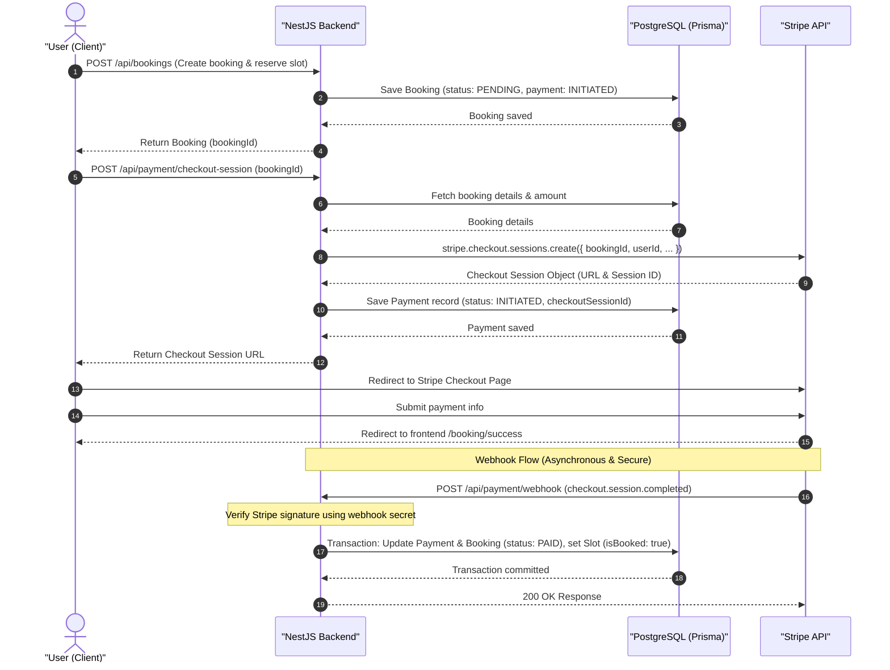

# Stripe Payment System Integration Plan

This plan outlines the architecture, data flow, API endpoints, webhook handling, and database updates required to integrate the Stripe payment gateway securely into the TurfSync NestJS application.

---

## 1. System Architecture & Data Flow

Below is the sequence diagram showing how the frontend, NestJS backend, Database, and Stripe interact during the payment lifecycle.



---

## 2. API Endpoints Design

We will create two main endpoints in the `PaymentController`:

### 1. `POST /api/payment/checkout-session`
- **Purpose**: Creates a Stripe Checkout Session for a specific booking.
- **Guard**: `JwtAuthGuard` (Authenticated users only)
- **Request Body**:
  ```json
  {
    "bookingId": "string"
  }
  ```
- **Response**:
  ```json
  {
    "sessionId": "cs_test_...",
    "url": "https://checkout.stripe.com/c/pay/..."
  }
  ```

### 2. `POST /api/payment/webhook`
- **Purpose**: Listens to Stripe events (e.g. `checkout.session.completed`) to update booking and payment states in the background.
- **Guard**: None (Public endpoint, but strictly validated by Stripe Signature verification).
- **Request Headers**: Must include `stripe-signature`.
- **Request Body**: Raw buffer from Stripe request.

---

## 3. Database State Management

During the checkout flow, the state of the `Booking`, `Payment`, and `Slot` records will transition as follows:

| Action | Booking Status | Booking PaymentStatus | Payment Status | Slot isBooked |
| :--- | :--- | :--- | :--- | :--- |
| **1. Create Booking** | `PENDING` | `INITIATED` | `INITIATED` | `false` |
| **2. Stripe Success (Webhook)** | `CONFIRMED` | `PAID` | `PAID` | `true` |
| **3. Failure / Timeout** | `CANCELLED` | `FAILED` | `FAILED` | `false` |

---

## 4. Required Environment Variables

Add the following keys to your `.env` and `.env.development.local` files:

```env
# Stripe Configurations
STRIPE_SECRET_KEY=sk_test_...
STRIPE_WEBHOOK_SECRET=whsec_...
FRONTEND_URL=http://localhost:3000
```

---

## 5. Security & Best Practices

> [!IMPORTANT]
> **Stripe Webhook Signature Verification**
> We must always verify the webhook signature using `stripe.webhooks.constructEvent()` with the raw request body buffer. This prevents attackers from spoofing payment success requests.

> [!TIP]
> **Prisma Transactions**
> Updating the `Payment` to `PAID`, `Booking` to `CONFIRMED`, and `Slot` to `isBooked: true` must be done in a single Prisma `$transaction` to ensure atomic state updates. If any step fails, the whole database state is rolled back.

---

## 6. Directory Structure & Files to Modify

We will organize the code within the existing `/src/payment` directory:

```bash
src/payment/
├── dto/
│   └── create-checkout-session.dto.ts   # Request validation DTO
├── payment.controller.ts                # Checkout session & Webhook routes
├── payment.module.ts                    # Module declarations & Stripe registration
└── payment.service.ts                   # Stripe logic & DB updates
```
